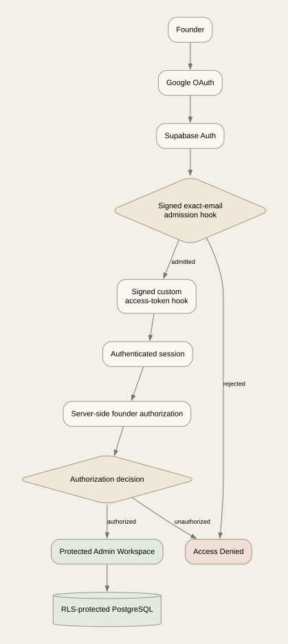

# Authentication Flow Diagram

**Generated artifact — do not edit by hand.**  
Flow fingerprint: `520acaee433e8ba33e0dff6001eb7874954c46866363fd54cfc603e3684d599f`



```mermaid
flowchart TD
  Founder[Founder] --> GitHub[GitHub OAuth]
  GitHub --> Supabase[Supabase Auth]
  Supabase --> Admission{Signed exact-email admission hook}
  Admission -->|Rejected| Denied[Access Denied]
  Admission -->|Admitted| TokenHook[Signed custom access-token hook]
  TokenHook --> RoleClaim[user_role=admin claim]
  RoleClaim --> Session[Authenticated session]
  Session --> RequireAdmin[requireAdmin()]
  RequireAdmin --> Decision{Authorization decision}
  Decision -->|Unauthorized| Denied
  Decision -->|Authorized| Admin[Protected Admin Workspace]
  Admin --> RLS[RLS-protected PostgreSQL]
```
