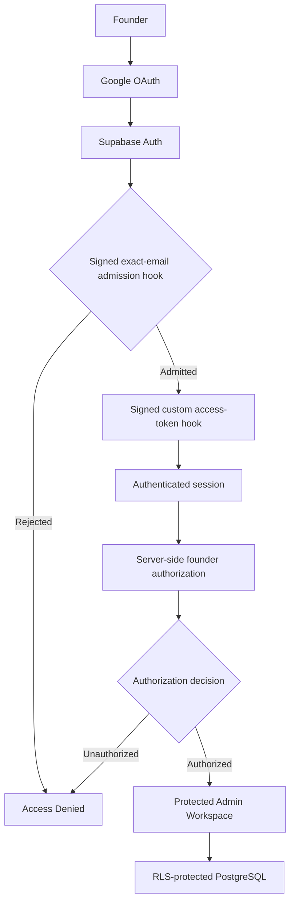

# Authentication Flow Diagram

**Generated artifact — do not edit by hand.**  
Flow fingerprint: `5bcda1c9691dadb4195c2aac3ff676f925a4fbe0b0fa1606766c45dcc0163985`

```mermaid
flowchart TD
  Founder[Founder] --> Google[Google OAuth]
  Google --> Supabase[Supabase Auth]
  Supabase --> Admission{Signed exact-email admission hook}
  Admission -->|Rejected| Denied[Access Denied]
  Admission -->|Admitted| TokenHook[Signed custom access-token hook]
  TokenHook --> Session[Authenticated session]
  Session --> ServerCheck[Server-side founder authorization]
  ServerCheck --> Decision{Authorization decision}
  Decision -->|Unauthorized| Denied
  Decision -->|Authorized| Admin[Protected Admin Workspace]
  Admin --> RLS[RLS-protected PostgreSQL]
```
