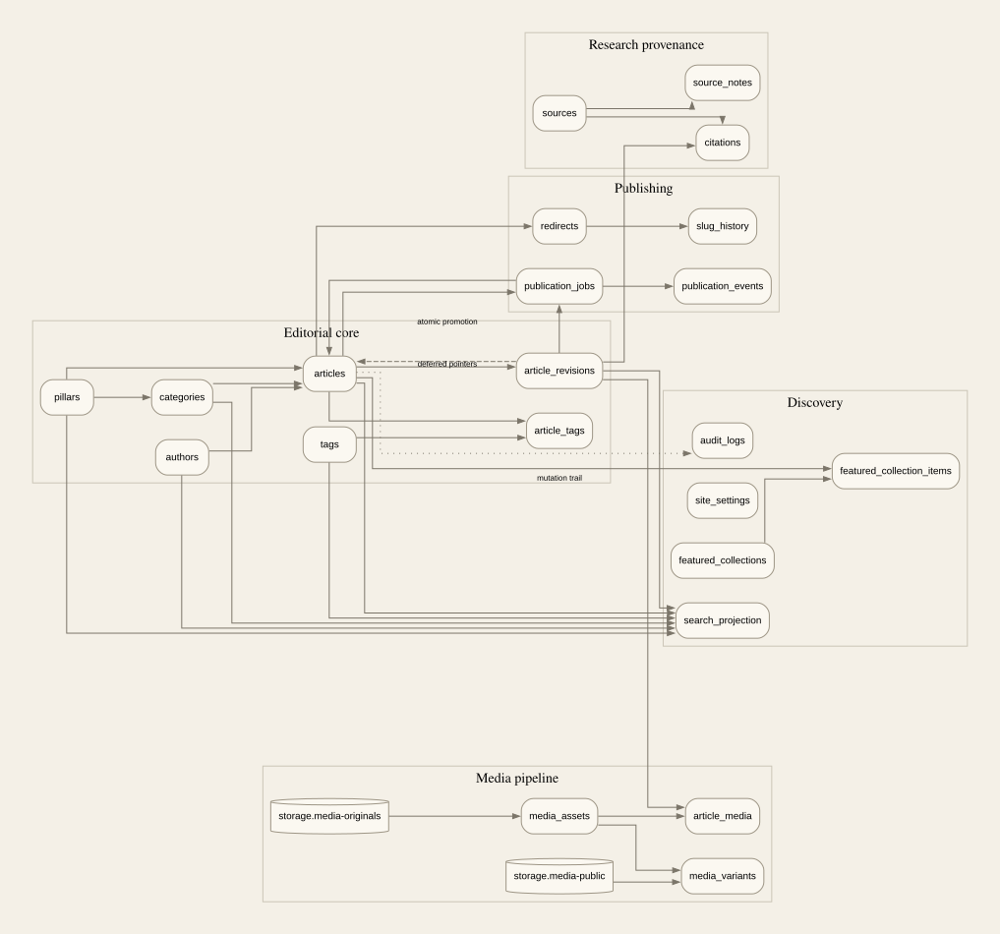
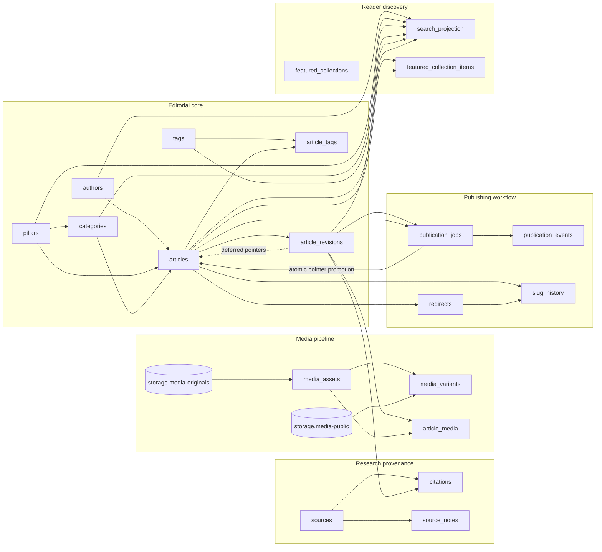

# Subtext Media Database Dependency Graph

**Generated artifact — do not edit by hand.**  
Schema fingerprint: `33159f0aacbf038f1aca92e9b0de356123938f5e2e143b5a48ab074b71c1cf98`

## Migration dependency order

1. `20260808000100_extensions_and_enums.sql`
2. `20260808000200_taxonomy_and_authors.sql`
3. `20260808000300_articles_revisions_and_research.sql`
4. `20260808000400_media.sql`
5. `20260808000500_publishing_discovery_and_operations.sql`
6. `20260808000600_functions_triggers_and_views.sql`
7. `20260808000700_row_level_security_and_grants.sql`
8. `20260808000800_storage_buckets_and_policies.sql`
9. `20260808001000_cms_atomic_commands.sql`
10. `20260808001100_publishing_worker_commands.sql`
11. `20260824000100_step2b_live_schema_reconciliation.sql`

## Table creation order

1. `authors` — `20260808000200_taxonomy_and_authors.sql`
2. `pillars` — `20260808000200_taxonomy_and_authors.sql`
3. `categories` — `20260808000200_taxonomy_and_authors.sql`
4. `tags` — `20260808000200_taxonomy_and_authors.sql`
5. `articles` — `20260808000300_articles_revisions_and_research.sql`
6. `article_revisions` — `20260808000300_articles_revisions_and_research.sql`
7. `article_tags` — `20260808000300_articles_revisions_and_research.sql`
8. `sources` — `20260808000300_articles_revisions_and_research.sql`
9. `source_notes` — `20260808000300_articles_revisions_and_research.sql`
10. `citations` — `20260808000300_articles_revisions_and_research.sql`
11. `media_assets` — `20260808000400_media.sql`
12. `media_variants` — `20260808000400_media.sql`
13. `article_media` — `20260808000400_media.sql`
14. `redirects` — `20260808000500_publishing_discovery_and_operations.sql`
15. `slug_history` — `20260808000500_publishing_discovery_and_operations.sql`
16. `site_settings` — `20260808000500_publishing_discovery_and_operations.sql`
17. `featured_collections` — `20260808000500_publishing_discovery_and_operations.sql`
18. `featured_collection_items` — `20260808000500_publishing_discovery_and_operations.sql`
19. `publication_jobs` — `20260808000500_publishing_discovery_and_operations.sql`
20. `publication_events` — `20260808000500_publishing_discovery_and_operations.sql`
21. `search_projection` — `20260808000500_publishing_discovery_and_operations.sql`
22. `audit_logs` — `20260808000500_publishing_discovery_and_operations.sql`

The only intentional cycle is `articles ↔ article_revisions`: the article is created first, revisions reference it, and two deferred article pointer foreign keys are added afterward.

## Delete/update cascade paths

- `articles` → `article_tags` via `article_tags_article_id_fkey`: ON DELETE CASCADE, ON UPDATE RESTRICT.
- `media_assets` → `authors` via `authors_avatar_media_asset_fk`: ON DELETE SET NULL, ON UPDATE RESTRICT.
- `featured_collections` → `featured_collection_items` via `featured_collection_items_collection_id_fkey`: ON DELETE CASCADE, ON UPDATE RESTRICT.
- `articles` → `search_projection` via `search_projection_article_id_fkey`: ON DELETE CASCADE, ON UPDATE RESTRICT.
- `sources` → `source_notes` via `source_notes_source_id_fkey`: ON DELETE CASCADE, ON UPDATE RESTRICT.

All other foreign keys use RESTRICT/NO ACTION to preserve publication history and provenance.

## Publishing workflow dependencies

1. `articles` owns lifecycle state and points to an immutable `article_revisions` row.
2. `publication_jobs` targets both the stable article and exact immutable revision.
3. `publication_events` append step-level worker evidence.
4. Atomic pointer/status promotion refreshes `search_projection` through a database trigger.
5. Slug or pillar changes create `redirects` and one-to-one immutable `slug_history` rows.
6. Public views read only the currently published revision.

## Search indexing dependencies

`search_projection` depends on `articles`, `article_revisions`, `authors`, `pillars`, `categories`, `article_tags`, and `tags`. Triggers refresh the projection when publication pointers, bylines, taxonomy, slugs, or tags change. The generated `search_vector` drives weighted FTS; GIN trigram indexes cover title and slug fallbacks.

## Media pipeline dependencies

1. The private `media-originals` bucket stores source objects referenced by `media_assets.original_storage_key`.
2. `media_assets` stores provenance, rights, focal point, and processing state.
3. `media_variants` stores immutable, pre-generated derivative metadata and public object keys.
4. `article_media` attaches an asset to one immutable revision with role, order, alt text, caption, and credit.
5. `published_media` exposes only ready, rights-cleared, public derivative metadata.
