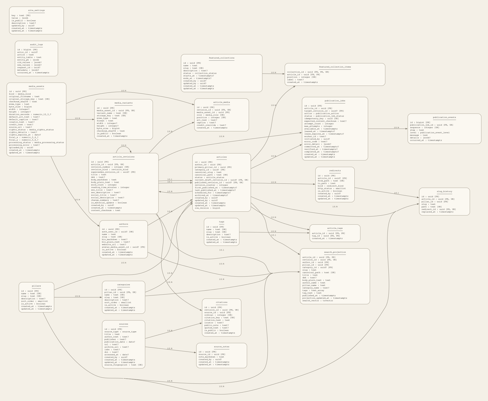

# Subtext Media Entity Relationship Diagram

**Generated artifact — do not edit by hand.**  
Schema fingerprint: `33159f0aacbf038f1aca92e9b0de356123938f5e2e143b5a48ab074b71c1cf98`

The diagram includes all Subtext-owned base tables, primary/foreign/unique key markers, relationship labels, and inferred cardinality. Supabase-managed Storage tables are external platform dependencies and are represented in the dependency graph rather than duplicated here.

```mermaid
erDiagram
  %% GENERATED from supabase/migrations. Do not edit by hand.
  article_media {
    uuid id PK
    uuid revision_id FK, UK
    uuid media_asset_id FK
    media_role role UK
    integer position UK
    text alt_text
    text caption
    text credit_override
    timestamptz created_at
  }
  article_revisions {
    uuid id PK
    uuid article_id FK, UK
    integer revision_number UK
    revision_kind revision_kind
    uuid supersedes_revision_id FK
    text title
    text dek
    text body_markdown
    text body_plain_text
    integer word_count
    integer reading_time_minutes
    text seo_title
    text seo_description
    text social_title
    text social_description
    text change_summary
    boolean is_material_update
    uuid created_by
    timestamptz created_at
    text content_checksum
  }
  article_tags {
    uuid article_id FK, PK
    uuid tag_id FK, PK
    timestamptz created_at
  }
  articles {
    uuid id PK
    uuid author_id FK
    uuid primary_pillar_id FK
    uuid category_id FK
    text canonical_slug
    text canonical_path UK
    article_status status
    uuid current_draft_revision_id FK, UK
    uuid published_revision_id FK, UK
    integer revision_counter
    timestamptz first_published_at
    timestamptz last_published_at
    timestamptz scheduled_for
    timestamptz archived_at
    uuid created_by
    uuid updated_by
    timestamptz created_at
    timestamptz updated_at
    bigint row_version
  }
  audit_logs {
    bigint id PK
    uuid actor_id
    text action
    text entity_table
    jsonb entity_pk
    jsonb old_values
    jsonb new_values
    uuid request_id
    jsonb metadata
    timestamptz occurred_at
  }
  authors {
    uuid id PK
    uuid auth_user_id UK
    text name
    text slug UK
    text bio_markdown
    text bio_plain_text
    text website_url
    uuid avatar_media_asset_id FK
    boolean is_active
    timestamptz created_at
    timestamptz updated_at
  }
  categories {
    uuid id PK
    uuid pillar_id FK, UK
    text name UK
    text slug UK
    text description
    smallint sort_order
    boolean is_active
    timestamptz created_at
    timestamptz updated_at
  }
  citations {
    uuid id PK
    uuid revision_id FK, UK
    uuid source_id FK
    integer ordinal UK
    text citation_key UK
    text citation_text
    text locator
    text public_note
    text quoted_text
    boolean is_public
    timestamptz created_at
  }
  featured_collection_items {
    uuid collection_id FK, PK, UK
    uuid article_id FK, PK
    integer position UK
    text label
    timestamptz created_at
  }
  featured_collections {
    uuid id PK
    text name
    text slug UK
    text description
    collection_status status
    timestamptz starts_at
    timestamptz ends_at
    uuid created_by
    uuid updated_by
    timestamptz created_at
    timestamptz updated_at
  }
  media_assets {
    uuid id PK
    media_kind kind
    text original_filename
    text original_storage_key UK
    text checksum_sha256
    text mime_type
    bigint byte_size
    integer width
    integer height
    numeric_12_3_ duration_seconds
    text default_alt_text
    text default_caption
    text creator_text
    text credit_text
    text source_url
    media_rights_status rights_status
    text rights_details
    date rights_expires_at
    numeric_5_4_ focal_x
    numeric_5_4_ focal_y
    media_processing_status processing_status
    text processing_error
    uuid uploaded_by
    timestamptz created_at
    timestamptz updated_at
  }
  media_variants {
    uuid id PK
    uuid media_asset_id FK, UK
    text variant_name UK
    text storage_key UK
    text mime_type
    text format
    integer width
    integer height
    bigint byte_size
    text checksum_sha256
    boolean is_public
    timestamptz created_at
  }
  pillars {
    uuid id PK
    text name UK
    text slug UK
    text description
    smallint sort_order
    boolean is_active
    timestamptz created_at
    timestamptz updated_at
  }
  publication_events {
    bigint id PK
    uuid publication_job_id FK, UK
    integer sequence UK
    text step
    publication_event_level level
    text message
    jsonb details
    timestamptz occurred_at
  }
  publication_jobs {
    uuid id PK
    uuid article_id FK
    uuid target_revision_id FK
    publication_action action
    publication_job_status status
    uuid idempotency_key UK
    text expected_content_checksum
    integer attempt_count
    integer max_attempts
    timestamptz available_at
    timestamptz leased_at
    timestamptz lease_expires_at
    text worker_id
    uuid initiated_by
    text error_code
    jsonb error_detail
    timestamptz committed_at
    timestamptz verified_at
    timestamptz completed_at
    timestamptz created_at
    timestamptz updated_at
  }
  redirects {
    uuid id PK
    uuid article_id FK
    text from_path UK
    text to_path
    redirect_kind kind
    smallint http_status
    boolean is_active
    uuid created_by
    timestamptz created_at
    timestamptz updated_at
  }
  search_projection {
    uuid article_id FK, PK
    uuid revision_id FK, UK
    uuid author_id FK
    uuid pillar_id FK
    uuid category_id FK
    text slug
    text canonical_path UK
    text title
    text dek
    text body_plain_text
    text author_name
    text pillar_name
    text category_name
    text_array tags
    text tag_text
    timestamptz published_at
    timestamptz projection_updated_at
    tsvector search_vector
  }
  site_settings {
    text key PK
    jsonb value
    boolean is_public
    text description
    uuid updated_by
    timestamptz created_at
    timestamptz updated_at
  }
  slug_history {
    uuid id PK
    uuid article_id FK, UK
    uuid pillar_id FK
    text slug
    text path UK
    uuid redirect_id FK, UK
    timestamptz replaced_at
  }
  source_notes {
    uuid id PK
    uuid source_id FK
    text note_markdown
    uuid created_by
    timestamptz created_at
    timestamptz updated_at
  }
  sources {
    uuid id PK
    source_type source_type
    text title
    text author_text
    text publisher
    date publication_date
    text url
    text archive_url
    text isbn
    text doi
    date accessed_at
    uuid created_by
    timestamptz created_at
    timestamptz updated_at
    text source_fingerprint UK
  }
  tags {
    uuid id PK
    text name UK
    text slug UK
    text description
    boolean is_active
    timestamptz created_at
    timestamptz updated_at
  }
  media_assets ||--o{ article_media : "article_media_media_asset_id_fkey: media_asset_id"
  article_revisions ||--o{ article_media : "article_media_revision_id_fkey: revision_id"
  articles ||--o{ article_revisions : "article_revisions_article_id_fkey: article_id"
  article_revisions o|--o{ article_revisions : "article_revisions_supersedes_revision_id_fkey: supersedes_revision_id"
  articles ||--o{ article_tags : "article_tags_article_id_fkey: article_id"
  tags ||--o{ article_tags : "article_tags_tag_id_fkey: tag_id"
  authors ||--o{ articles : "articles_author_id_fkey: author_id"
  categories o|--o{ articles : "articles_category_id_fkey: category_id"
  article_revisions o|--o| articles : "articles_current_draft_revision_fk: current_draft_revision_id"
  pillars ||--o{ articles : "articles_primary_pillar_id_fkey: primary_pillar_id"
  article_revisions o|--o| articles : "articles_published_revision_fk: published_revision_id"
  media_assets o|--o{ authors : "authors_avatar_media_asset_fk: avatar_media_asset_id"
  pillars ||--o{ categories : "categories_pillar_id_fkey: pillar_id"
  article_revisions ||--o{ citations : "citations_revision_id_fkey: revision_id"
  sources ||--o{ citations : "citations_source_id_fkey: source_id"
  articles ||--o{ featured_collection_items : "featured_collection_items_article_id_fkey: article_id"
  featured_collections ||--o{ featured_collection_items : "featured_collection_items_collection_id_fkey: collection_id"
  media_assets ||--o{ media_variants : "media_variants_media_asset_id_fkey: media_asset_id"
  publication_jobs ||--o{ publication_events : "publication_events_publication_job_id_fkey: publication_job_id"
  articles ||--o{ publication_jobs : "publication_jobs_article_id_fkey: article_id"
  article_revisions o|--o{ publication_jobs : "publication_jobs_target_revision_id_fkey: target_revision_id"
  articles o|--o{ redirects : "redirects_article_id_fkey: article_id"
  articles ||--o| search_projection : "search_projection_article_id_fkey: article_id"
  authors ||--o{ search_projection : "search_projection_author_id_fkey: author_id"
  categories o|--o{ search_projection : "search_projection_category_id_fkey: category_id"
  pillars ||--o{ search_projection : "search_projection_pillar_id_fkey: pillar_id"
  article_revisions ||--o| search_projection : "search_projection_revision_id_fkey: revision_id"
  articles ||--o{ slug_history : "slug_history_article_id_fkey: article_id"
  pillars ||--o{ slug_history : "slug_history_pillar_id_fkey: pillar_id"
  redirects ||--o| slug_history : "slug_history_redirect_id_fkey: redirect_id"
  sources ||--o{ source_notes : "source_notes_source_id_fkey: source_id"
```

## Cardinality conventions

- `||` — exactly one parent is required by a non-null foreign key.
- `o|` — the parent link or one-to-one child is optional.
- `o{` — zero or many child rows.
- Many-to-many relationships are materialized through `article_tags` and `featured_collection_items`.
- `articles.current_draft_revision_id` and `articles.published_revision_id` form deliberate deferred circular references to immutable `article_revisions`.
