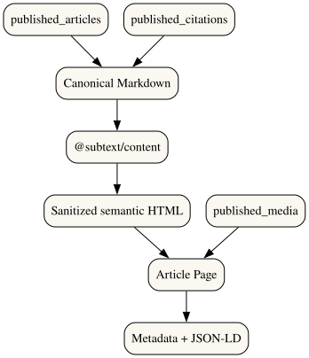

# Public Content Rendering Flow



```mermaid
flowchart TD
  View[published_articles] --> Revision[Canonical Markdown]
  Citations[published_citations] --> Revision
  Media[published_media] --> Page[Article Page]
  Revision --> Pipeline[@subtext/content]
  Pipeline --> Sanitize[Sanitized semantic HTML]
  Sanitize --> Page
  Page --> SEO[Metadata + JSON-LD]
```
