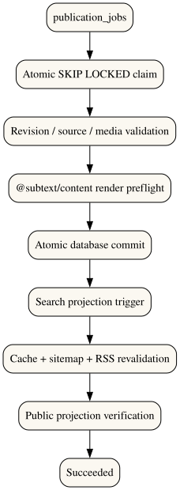

# Publishing Engine Flow



```mermaid
flowchart TD
  Job[publication_jobs] --> Claim[Atomic SKIP LOCKED claim]
  Claim --> Validate[Revision / source / media validation]
  Validate --> Preflight[@subtext/content render preflight]
  Preflight --> Commit[Atomic database commit]
  Commit --> Search[Search projection trigger]
  Search --> Revalidate[Targeted cache + sitemap + RSS revalidation]
  Revalidate --> Verify[Public projection verification]
  Verify --> Success[Succeeded]
```
